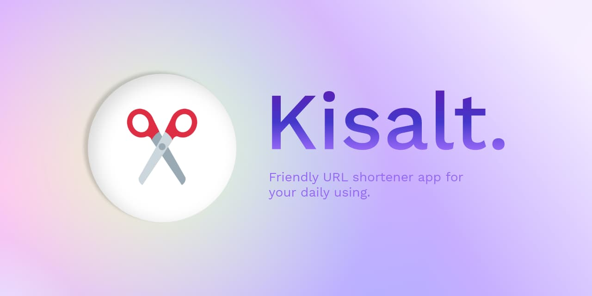
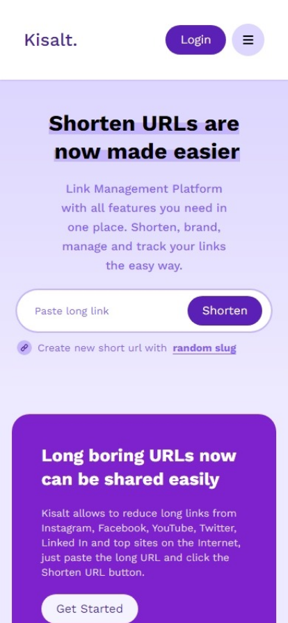
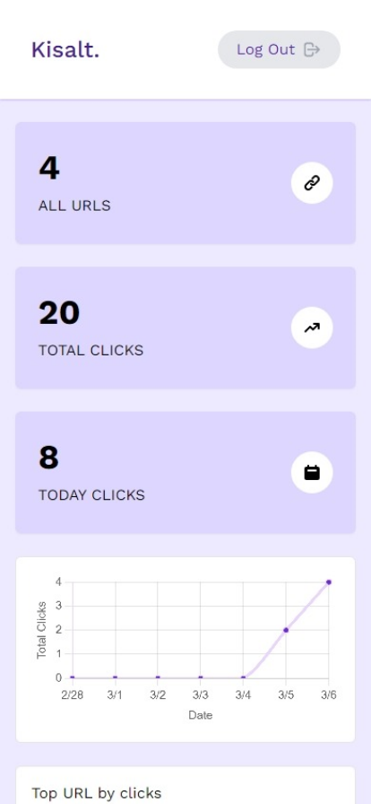
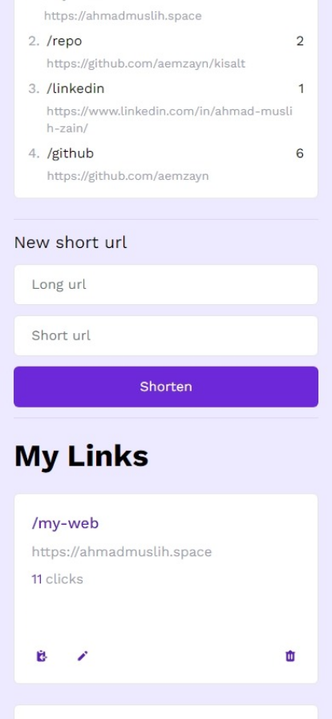
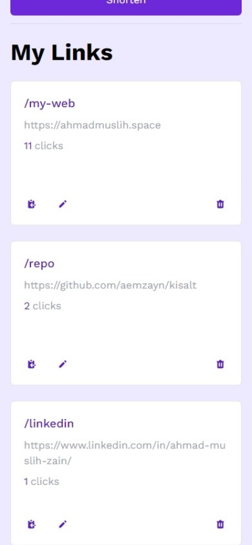

# [Kisalt](https://kisalt.one)



**Kisalt** is friendly URL shortener app. The purpose of **kisalt** is to be simple minimalist and to be easy to use. There's also statistics and a graph but all keep as minimal as possible. **Kisalt** is made for people who are more concerned with functionality, simplicity, and don't need too detailed statistics.

## Screenshots

<table>
 <tbody>
  <tr>
     <td>
       
     </td>
     <td>
       
     </td>
  </tr>
   <tr>
     <td>
       
     </td>
     <td>
       
     </td>
   </tr>
 </tbody>
</table>

## Features

- Open source
- Responsive UI
- Full authentication
  - Login (With email and Google)
  - Register (With email and Google)
  - Forget password and set new password
- Dashboard
  - Total clicks of every short URL
  - Line graph of total clicks from last 7 days
  - Top URLs list by total clicks
  - Today total clicks
- Share link by using Clipboard

## Installation

Copy file .env.local.example to .env.local and change value with your own supabase url and anonymous key. You can get it after register and create your own project on Supabase.io.

```
NEXT_PUBLIC_SUPABASE_URL=https://your-project.supabase.co
NEXT_PUBLIC_SUPABASE_ANON_KEY=your-anon-key
```

## Creating table on Supabase

Go to the SQL tab and execute this query to make the `urls` table on the editor.

```sql
create table urls (
  id bigint generated by default as identity primary key,
  user_id uuid references auth.users not null,
  real_url text check (char_length(real_url) > 1),
  slug text check (char_length(slug) > 1),
  inserted_at timestamp with time zone default timezone('utc'::text, now()) not null,
  updated_at timestamp with time zone default timezone('utc'::text, now()) not null
);
```

After click **RUN**, open a new query and make the `clicks` table.

```sql
create table clicks (
  id bigint generated by default as identity primary key,
  user_id uuid references auth.users not null,
  url_ud uuid references urls.id ,
  created_at timestamp with time zone default timezone('utc'::text, now()) not null
)
```

Make sure to click the **RUN** button to execute the query.

## Creating triggers on Supabase

Go to the SQL tab and execute this query on the editor.

Add triggers for "updated_at" field, copy this code on the same SQL editor

```sql
create extension if not exists moddatetime schema extensions;

-- this trigger will set the "updated_at" column to the current timestamp for every update
create trigger handle_updated_at before update on public.urls
  for each row execute procedure moddatetime (updated_at);
```

Click **RUN** to execute the query

## Creating View on Supabase

Go to SQL tab and execute these queries on the editor.

```sql
create view distinct_users as
    select distinct(user_id) from public.urls;
```

This `urls_data` view will return data for the dashboard.

```sql
create view urls_data as
select
  urls.id as url_id,
  urls.user_id as user_id,
  clicks.id as click_id,
  urls.slug,
  urls.real_url,
  coalesce(nullif(abs(extract(year from clicks.created_at)), 0), 0) as click_year,
  coalesce(nullif(abs(extract(month from clicks.created_at)), 0), 0) as click_month,
  coalesce(nullif(abs(extract(day from clicks.created_at)), 0), 0) as click_day,
  coalesce(nullif(abs(extract(day from NOW()::timestamp - clicks.created_at::timestamp)), 0), 0) as day_diff
from urls
full join clicks on clicks.url_id = urls.id
order by day_diff
```

This `chart_data` view will return data the last 7 days chart data.

```sql
create view chart_data as
select
  urls.user_id as user_id,
  extract(day from created_at) as click_day,
  extract(month from created_at) as click_month,
  count(clicks) as total_clicks
from clicks
join urls on urls.id = clicks.url_id
where abs(extract(day from NOW()::timestamp - created_at::timestamp)) between 0 and 6
group by click_day, click_month, clicks.url_id, urls.user_id
order by click_day desc, click_month desc
```

Click **RUN** to execute the query

## Additional settings for Authentication

- on Authentication setting, change Site URL to /callback. e.g: https://kisalt.one/callback, for development just set it to http://localhost:3000/callback
- To support Google Login, in Authentication setting page, set the Google Client ID and Google Secret
- Increase JWT expiry time to 604800 for longer session. It's on on Authentication setting men

## Add environment variables on Vercel

You can found all required environment variables on .env.local.example

## Credits

- [Ksana.in](https://github.com/mazipan/ksana.in)
- Hero photo by [Štefan Štefančík (Unsplash)](https://unsplash.com/@cikstefan)
- Laptop photo by [Kari Shea (Unsplash)](https://unsplash.com/@karishea)
- 404 page photo by [whereslugo (Unsplash)](https://unsplash.com/@whereslugo)
- 500 page photo by [Sammy Williams (Unsplash)](https://unsplash.com/@sammywilliams)

## Stack used

- [Next js](https://nextjs.org/)
- [Typescript](https://www.typescriptlang.org/)
- [Tailwind CSS](https://tailwindcss.com/)
- [SWR](https://swr.vercel.app/)
- [Heroicons](https://heroicons.com/)

---

Copyright ©️ 2023 by Ahmad Muslih Zain
